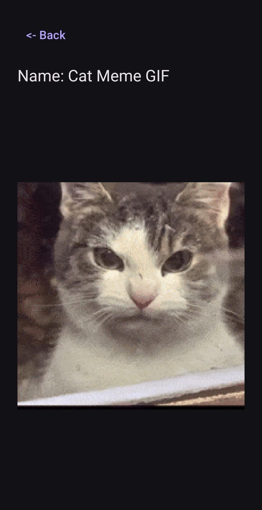

# Giphy Search Android

A small Android app for searching and viewing animated GIFs using the GIPHY API.

Built with Kotlin, Jetpack Compose, MVVM, Koin, Retrofit, Coroutines, and Coil.

## Features

- Search GIFs with a 400 ms debounce
- Infinite-scroll pagination
- Animated GIF grid
- GIF details screen
- Initial loading state
- Pagination loading state
- Empty-state handling
- API and network error handling
- Portrait and landscape support
- Light and dark theme support
- Responsive adaptive grid
- Koin dependency injection
- Compose previews
- Unit tests for search and pagination logic

## Tech Stack

- Kotlin
- Jetpack Compose
- MVVM
- Koin
- Retrofit
- Kotlin Coroutines
- StateFlow
- Coil
- Navigation Compose
- JUnit
- kotlinx-coroutines-test

## Architecture

The app follows a simple MVVM structure:

```text
Compose UI
    ↓
ViewModel
    ↓
Repository
    ↓
Retrofit API
    ↓
GIPHY
```

UI state is exposed from the ViewModels using `StateFlow`.

Koin is used to provide the API, repository, and ViewModels.

## Setup

### 1. Clone the repository

```bash
git clone https://github.com/HelvijsGulans/Giphy-Search-Android.git
```

### 2. Get a GIPHY API key

Create an API key through the GIPHY Developers website.

### 3. Add the API key

Add the following line to the project's `local.properties` file:

```properties
GIPHY_API_KEY=YOUR_API_KEY
```

The API key is intentionally excluded from version control.

### 4. Run the project

Open the project in Android Studio, sync Gradle, and run it on an Android device or emulator.

## Testing

Run unit tests with:

```bash
./gradlew test
```

On Windows:

```bash
gradlew.bat test
```

The current tests cover core search and pagination behavior in `SearchViewModel`.

## Notes

- Search requests are debounced to reduce unnecessary API calls.
- Pagination is triggered automatically when the user approaches the end of the grid.
- The grid uses adaptive columns so the layout responds to portrait and landscape orientations.
- The app follows the device's light/dark theme.
- GIF thumbnails are loaded and cached with Coil.

## API

This project uses the GIPHY API:

https://developers.giphy.com/

## Screenshots

<div style="text-align: center;">
    
    
    
</div>


## License

This project was created as a technical take-home assignment.